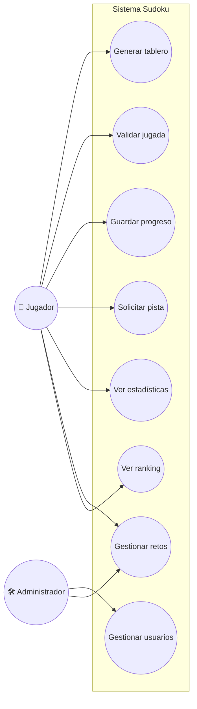

# Plataforma Web de Sudoku Interactivo

# Descripción General.

Desarrollar una plataforma web donde los usuarios puedan jugar Sudoku en diferentes niveles de dificultad, validar sus jugadas, guardar su progreso, solicitar pistas, ver estadísticas personales y acceder a rankings globales. Habrá un rol de administrador encargado de gestionar usuarios y crear nuevos retos.

---

## 2. Objetivos del Proyecto

| **ID** | **Objetivo SMART**                                                               | **Tipo**    | **Métrica**                     | **Fecha Límite** | **Responsable**     | **Estado**  |
| ------ | -------------------------------------------------------------------------------- | ----------- | ------------------------------ | ---------------- | ------------------- | ----------- |
| OBJ-01 | Implementar tablero Sudoku con validación instantánea en 2 meses.                 | Estratégico | % funcionalidades implementadas | 2025-07-01       | Equipo de Desarrollo | No iniciado |
| OBJ-02 | Permitir guardar y cargar progreso en 100% de partidas antes de 3 meses.         | Operativo   | % partidas con guardado         | 2025-07-15       | Equipo de Desarrollo | No iniciado |
| OBJ-03 | Integrar sistema de pistas con límite de uso y feedback claro para usuario.      | Táctico     | % usuarios que usan pistas      | 2025-07-30       | Equipo de Desarrollo | En progreso |
| OBJ-04 | Desarrollar sistema de rankings con actualización diaria.                        | Estratégico | Frecuencia actualización        | 2025-08-15       | Equipo de Producto   | No iniciado |
| OBJ-05 | Implementar panel de administración para gestión de usuarios y retos en 2 meses. | Operativo   | Funcionalidades panel admin     | 2025-07-30       | Equipo de Desarrollo | En progreso |

## 3. Requisitos Funcionales

| **ID** | **Descripción**                                                                                 | **Prioridad** | **Fuente**          | **Estado** |
| ------ | ----------------------------------------------------------------------------------------------- | ------------- | ------------------- | ---------- |
| RF-01  | Generar tablero Sudoku válido con nivel de dificultad seleccionado.                             | Alta          | Análisis interno    | Propuesto  |
| RF-02  | Validar jugadas en tiempo real y mostrar errores o aciertos.                                   | Alta          | Análisis interno    | Propuesto  |
| RF-03  | Guardar y cargar el progreso de partidas para usuarios autenticados.                           | Alta          | Análisis interno    | Propuesto  |
| RF-04  | Permitir solicitar pistas limitadas por partida.                                              | Media         | Análisis interno    | Propuesto  |
| RF-05  | Mostrar estadísticas personales: partidas jugadas, completadas, tiempos promedio.             | Media         | Análisis interno    | Propuesto  |
| RF-06  | Mostrar rankings globales actualizados diariamente.                                           | Media         | Análisis interno    | Propuesto  |
| RF-07  | Gestión de usuarios: registro, inicio sesión, roles (jugador, administrador).                  | Alta          | Análisis interno    | Propuesto  |
| RF-08  | Panel administrador para crear, modificar y eliminar retos Sudoku.                            | Alta          | Análisis interno    | Propuesto  |
| RF-09  | Sistema de notificaciones para alertar al usuario sobre logros o recordatorios.               | Media         | Análisis interno    | Propuesto  |
| RF-10  | Soporte para múltiples dispositivos (responsive design).                                      | Alta          | Análisis interno    | Propuesto  |

## 4. Requisitos No Funcionales

| **ID** | **Descripción**                                          | **Categoría**  | **Métrica**                      | **Nivel Objetivo**   | **Comentarios**                         |
| ------ | -------------------------------------------------------- | -------------- | -------------------------------- | -------------------- | -------------------------------------- |
| RNF-01 | Tiempo de respuesta al validar jugada < 150 ms          | Rendimiento    | Latencia                         | < 150 ms             | Medición con pruebas de carga.          |
| RNF-02 | Disponibilidad del sistema ≥ 99,5 % mensual              | Disponibilidad | % Uptime                        | ≥ 99,5 %             | Monitorización continua y alertas.      |
| RNF-03 | Cumplir HTTPS/TLS para todas las comunicaciones          | Seguridad      | Cifrado                         | TLS 1.2+ obligatorio | Auditorías de seguridad periódicas.     |
| RNF-04 | Interfaz accesible y compatible con WCAG 2.1 AA          | Usabilidad     | Puntuación auditoría accesible  | Nivel AA             | Auditoría externa antes del lanzamiento.|
| RNF-05 | Soportar al menos 5 000 usuarios concurrentes            | Escalabilidad  | Usuarios concurrentes           | ≥ 5 000              | Autoescalado en la nube.                 |
| RNF-06 | Guardado automático cada 30 segundos                      | Rendimiento    | Frecuencia de guardado          | ≤ 30 seg             | Prevención de pérdida de datos.          |
| RNF-07 | Encriptación de datos sensibles en tránsito y reposo     | Seguridad      | Cifrado                        | AES-256 o equivalente | Protección avanzada de datos.            |
| RNF-08 | Compatibilidad con navegadores modernos y móviles        | Compatibilidad | Soporte                        | Chrome, Firefox, Safari, Edge, iOS, Android | Testing multiplataforma.        |

---

## 5. Diagramas UML

### 5.1 Diagrama de Casos de Uso

