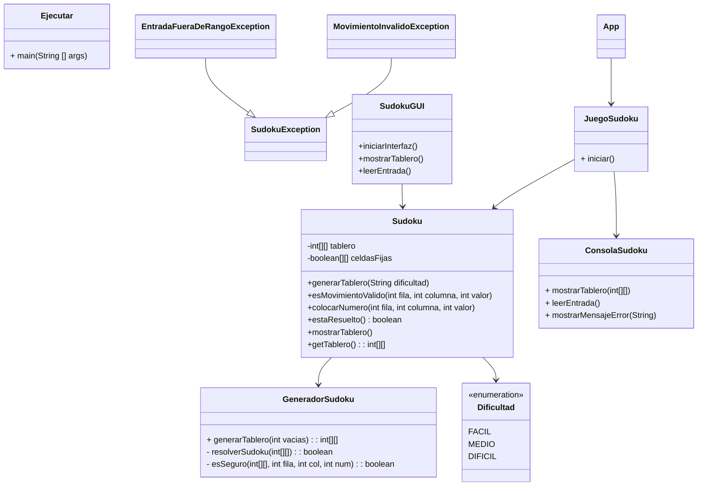

# Sudoku

```mermaid
    classDiagram
        class Ejecutar {
            + main (String [] args)
        }

        class EntradaFueraDeRangoException {

        }

        class MovimientoInvalidoException {
            
        }

        class SudokuException {
            
        }

        class JuegoSudoku {
            + iniciar()
        }

        class Dificultad {
            <<enumeration>>
            FACIL
            MEDIO
            DIFICIL
        }

        class GeneradorSudoku {
            + generarTablero(int vacias): int[][]
            - resolverSudoku(int[][]): boolean
            - esSeguro(int[][], int fila, int col, int num): boolean
        }

        class Sudoku {
            -int[][] tablero
            -boolean[][] celdasFijas

            +generarTablero(String dificultad)
            +esMovimientoValido(int fila, int columna, int valor)
            +colocarNumero(int fila, int columna, int valor)
            +estaResuelto() boolean
            +mostrarTablero()
            +getTablero(): int[][]
        }

        class ConsolaSudoku {
            + mostrarTablero(int[][])
            + leerEntrada()
            + mostrarMensajeError(String)
        }

        class SudokuGUI {
            +iniciarInterfaz()
            +mostrarTablero()
            +leerEntrada()
        }

    App --> JuegoSudoku
    JuegoSudoku --> Sudoku
    JuegoSudoku --> ConsolaSudoku
    Sudoku --> GeneradorSudoku
    Sudoku --> Dificultad
    MovimientoInvalidoException --|> SudokuException
    EntradaFueraDeRangoException --|> SudokuException
    SudokuGUI --> Sudoku
```